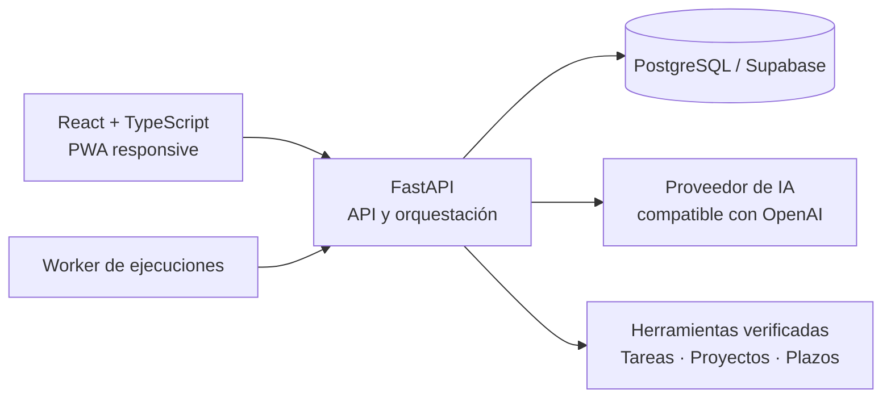

# PABLO OS

<p align="center">
  
</p>

<p align="center"><strong>Tu espacio personal para pensar, organizarte y actuar con IA.</strong></p>

<p align="center">
  <a href="https://pablo-os.onrender.com/demo"><strong>▶ Probar la demo interactiva</strong></a>
  ·
  <a href="docs/DEPLOYMENT.md">Desplegar</a>
  ·
  <a href="CONTRIBUTING.md">Contribuir</a>
</p>

> **Demo pública:** funciona sin cuenta, no conecta servicios reales y conserva los cambios únicamente durante la pestaña actual. Al recargar, los datos de ejemplo se restauran.

PABLO OS es una agenda personal con un asistente de IA. Cuenta lo que tienes que hacer y organiza tus tareas, proyectos y plazos desde una conversación, en el ordenador o en el móvil.

> **Estado:** beta en desarrollo activo. La demo interpreta ejemplos de forma local, sin conectarse a un modelo ni guardar datos de los visitantes. La aplicación personal utiliza el proveedor de IA que configure su propietario.

## Qué puede hacer

- **Apuntar deberes y tareas:** guardar títulos, descripciones, prioridades y fechas de entrega.
- **Organizar proyectos:** reunir tareas dentro de un objetivo y ver su progreso.
- **Editar sin duplicar:** cambiar plazos, completar tareas y renombrar elementos existentes.
- **Eliminar con confirmación:** revisar la acción antes de borrar una tarea o proyecto.
- **Consultar la agenda:** ver pendientes, tareas para hoy, vencidas y completadas.
- **Conversar con IA:** pedir ayuda para dividir un trabajo y decidir por dónde empezar.
- **Móvil y escritorio:** PWA instalable con los mismos datos al usar la misma instancia en la nube.

Ejemplos:

> Añade una tarea llamada repasar matemáticas para mañana.
>
> Tengo un trabajo de historia para el viernes. Crea un proyecto y divídelo en tres tareas.
>
> Cambia la fecha de entrega del ensayo al lunes.
>
> Ya he terminado la tarea de matemáticas.

La navegación se limita a **Inicio, Asistente, Tareas, Proyectos y Ajustes**. Las integraciones externas y las automatizaciones ya no forman parte del asistente. El esquema de datos y algunos módulos históricos se conservan para no perder información existente; el worker no despacha las automatizaciones antiguas y rechaza herramientas retiradas.

## Principios del producto

1. **Una petición, una respuesta clara.** La interfaz oculta JSON y detalles internos cuando no aportan valor.
2. **Acciones comprobables.** Las operaciones estructuradas se validan antes de darse por completadas.
3. **Control humano.** Los cambios sensibles conservan sus pasos de aprobación.
4. **Privacidad por diseño.** Los secretos se cifran, las cookies son seguras en la nube y los datos privados no se almacenan en la caché de la PWA.
5. **Continuidad entre dispositivos.** La versión en la nube comparte los mismos datos entre ordenador y móvil.

## Arquitectura



El frontend se compila como una aplicación React responsive. FastAPI sirve la API y la interfaz, SQLAlchemy mantiene el modelo de datos y un worker procesa las peticiones del asistente. El contenedor de producción se despliega como un único servicio para simplificar la operación.

## Tecnologías

| Área | Tecnologías |
| --- | --- |
| Interfaz | React 19, TypeScript, Tailwind CSS, shadcn/ui, PWA |
| Backend | Python 3.12, FastAPI, Pydantic, SQLAlchemy, Alembic |
| Datos | PostgreSQL / Supabase; SQLite para desarrollo local |
| IA | API compatible con OpenAI, Groq u Ollama local |
| Documentos | pypdf, pdfplumber, python-docx |
| Despliegue | Docker, Render, Supabase |

## Puesta en marcha local

### Requisitos

- Node.js 22.13 o posterior
- Python 3.12

### Interfaz

```bash
npm ci
npm run build:local
```

### Backend

```bash
python -m venv .venv
# Windows: .venv\Scripts\activate
# macOS/Linux: source .venv/bin/activate
pip install -r backend/requirements-dev.txt
pytest backend/tests
```

Para una instalación local completa en Windows, los scripts de `scripts/local` preparan la base de datos, el proveedor de IA y el acceso directo. No incluyas credenciales en el repositorio; parte de [`.env.example`](.env.example).

## Despliegue

El repositorio incluye `Dockerfile` y `render.yaml`. La configuración de producción requiere PostgreSQL duradero, un origen HTTPS y secretos definidos en el proveedor de alojamiento. Consulta [la guía de despliegue](docs/DEPLOYMENT.md).

## Calidad

El proyecto mantiene pruebas para flujos de conversación, herramientas, integraciones, calendario, documentos, Workspace, autenticación, automatizaciones y comportamiento móvil. La integración continua ejecuta:

- pruebas del backend;
- análisis estático de Python;
- comprobación de tipos del frontend;
- lint de la aplicación;
- compilación de producción.

## Seguridad y privacidad

- No publiques `.env`, bases de datos, tokens OAuth, claves privadas ni documentos personales.
- Rota inmediatamente cualquier secreto que haya salido de tu dispositivo.
- Comunica vulnerabilidades siguiendo [SECURITY.md](SECURITY.md).

## Colaboración

Las propuestas y correcciones son bienvenidas. Lee [CONTRIBUTING.md](CONTRIBUTING.md) antes de abrir una incidencia o un cambio.

## Licencia

Copyright © 2026 Pablo Monserrat Sastre. Este proyecto se publica para mostrar su desarrollo. Consulta [LICENSE](LICENSE) para conocer las condiciones actuales.
