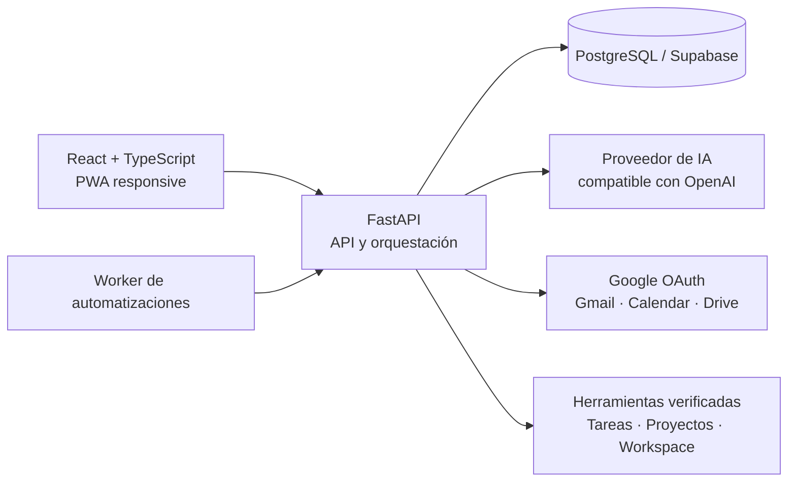

# PABLO OS

<p align="center">
  
</p>

<p align="center"><strong>Tu espacio personal para pensar, organizarte y actuar con IA.</strong></p>

PABLO OS es una aplicación web instalable que reúne conversación con IA, tareas, proyectos, calendario, documentos, automatizaciones e integraciones en una sola interfaz. Convierte peticiones en lenguaje natural en respuestas útiles o acciones verificables, manteniendo el control de los cambios sensibles en manos del usuario.

> **Estado:** beta privada en desarrollo activo. La arquitectura y el código están disponibles como muestra del proyecto; la instancia personal y sus datos no son públicos.

## Qué puede hacer

- **Asistente único:** conversa, consulta información y ejecuta acciones desde el mismo chat.
- **Organización personal:** gestiona tareas, proyectos, agenda, memoria y actividad.
- **Google Workspace:** consulta Gmail, sincroniza Google Calendar y trabaja con Drive mediante OAuth.
- **Documentos con contexto:** indexa PDF y DOCX, reconoce tablas y responde sobre horarios académicos.
- **Workspace creativo:** genera proyectos web en carpetas independientes, permite inspeccionarlos y abrir una vista previa.
- **Automatizaciones:** programa objetivos recurrentes y muestra su resultado en un resumen diario.
- **Integraciones:** conecta GitHub, n8n y servicios HTTP con credenciales cifradas.
- **Móvil y escritorio:** funciona como PWA en iPhone y como aplicación local en Windows.

## Principios del producto

1. **Una petición, una respuesta clara.** La interfaz oculta JSON y detalles internos cuando no aportan valor.
2. **Acciones comprobables.** Las operaciones estructuradas se validan antes de darse por completadas.
3. **Control humano.** Los cambios sensibles conservan sus pasos de aprobación.
4. **Privacidad por diseño.** Los secretos se cifran, las cookies son seguras en la nube y los datos privados no se almacenan en la caché de la PWA.
5. **Continuidad entre dispositivos.** La versión en la nube comparte los mismos datos entre ordenador y móvil.

## Arquitectura



El frontend se compila como una aplicación React responsive. FastAPI sirve la API y la interfaz, SQLAlchemy mantiene el modelo de datos y un worker recupera las automatizaciones pendientes. El contenedor de producción se despliega como un único servicio para simplificar la operación.

## Tecnologías

| Área | Tecnologías |
| --- | --- |
| Interfaz | React 19, TypeScript, Tailwind CSS, shadcn/ui, PWA |
| Backend | Python 3.12, FastAPI, Pydantic, SQLAlchemy, Alembic |
| Datos | PostgreSQL / Supabase; SQLite para desarrollo local |
| IA | API compatible con OpenAI, Groq u Ollama local |
| Documentos | pypdf, pdfplumber, python-docx |
| Despliegue | Docker, Render, Supabase |

## Puesta en marcha local

### Requisitos

- Node.js 22.13 o posterior
- Python 3.12

### Interfaz

```bash
npm ci
npm run build:local
```

### Backend

```bash
python -m venv .venv
# Windows: .venv\Scripts\activate
# macOS/Linux: source .venv/bin/activate
pip install -r backend/requirements-dev.txt
pytest backend/tests
```

Para una instalación local completa en Windows, los scripts de `scripts/local` preparan la base de datos, el proveedor de IA y el acceso directo. No incluyas credenciales en el repositorio; parte de [`.env.example`](.env.example).

## Despliegue

El repositorio incluye `Dockerfile` y `render.yaml`. La configuración de producción requiere PostgreSQL duradero, un origen HTTPS y secretos definidos en el proveedor de alojamiento. Consulta [la guía de despliegue](docs/DEPLOYMENT.md).

## Calidad

El proyecto mantiene pruebas para flujos de conversación, herramientas, integraciones, calendario, documentos, Workspace, autenticación, automatizaciones y comportamiento móvil. La integración continua ejecuta:

- pruebas del backend;
- análisis estático de Python;
- comprobación de tipos del frontend;
- lint de la aplicación;
- compilación de producción.

## Seguridad y privacidad

- No publiques `.env`, bases de datos, tokens OAuth, claves privadas ni documentos personales.
- Rota inmediatamente cualquier secreto que haya salido de tu dispositivo.
- Comunica vulnerabilidades siguiendo [SECURITY.md](SECURITY.md).

## Colaboración

Las propuestas y correcciones son bienvenidas. Lee [CONTRIBUTING.md](CONTRIBUTING.md) antes de abrir una incidencia o un cambio.

## Licencia

Copyright © 2026 Pablo Monserrat Sastre. Este proyecto se publica para mostrar su desarrollo. Consulta [LICENSE](LICENSE) para conocer las condiciones actuales.
